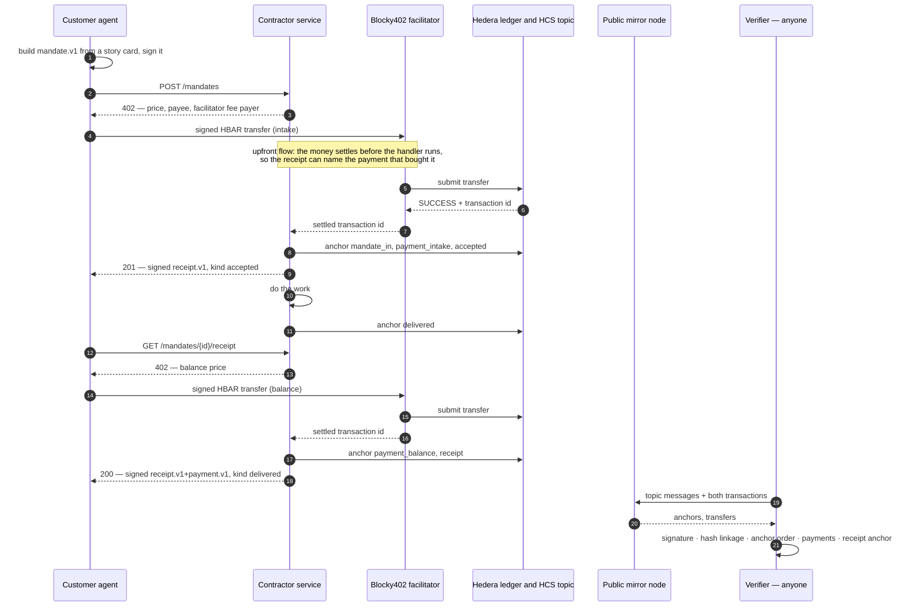

# x402-work-receipts

Work orders and receipts between the AI agents of two organizations: signed by both sides, paid with
x402 on Hedera, anchored on a public consensus topic, and verifiable by a stranger who has spoken to
neither party.

## What it is

When two companies let agents act for them — one ordering work, one accepting and doing it — the record
of what was ordered, agreed and delivered ends up inside one company's system. That party can edit it,
lose it, or simply be believed less than the other when the two accounts differ. The thesis this project
is built on, taken from a public engineering discussion: **no single party should be the sole owner of
the authoritative audit trail; a shared ledger records signed evidence of which agent, holding which
mandate, received, accepted and executed which command.**

This repository is a working instance of that. A customer agent turns a story card into a signed work
order and pays an intake fee; a contractor agent verifies the signature, anchors the order's fingerprint
on a Hedera consensus topic, and returns a signed acceptance naming the criteria it took on. When the
work exists, the customer pays the balance and collects a signed delivery receipt carrying both payments.
Six anchors go on the topic; not one of them carries content, only hashes. Anyone can then run the
verifier with a topic id and a receipt file and reach the same verdict either party would — reading the
public mirror node and nothing else. What that proves, and what it deliberately does not, is stated
below in the same words the verifier prints on every run.

## Setup

Node ≥ 22 (the code uses `node:` built-ins and native `fetch`). `npm install`, then create `.env` in the
repository root. It is gitignored and must stay that way: every value below is either a secret or an
account that spends money.

```bash
npm install
npm run anchor:create-topic      # once — prints the ANCHOR_TOPIC_ID to put in .env
npm run demo                     # the whole flow on testnet, then the verifier

npm test                         # every suite; the testnet ones skip when .env is absent
npm run typecheck                # tsc --noEmit over every module
```

**Required**

| Variable | Meaning |
|---|---|
| `HEDERA_OPERATOR_ID` | Account that pays for the HCS anchor messages |
| `HEDERA_OPERATOR_KEY` | Its private key |
| `HEDERA_OPERATOR_KEY_TYPE` | `ecdsa` (default) or `ed25519` — how that key is parsed |
| `ANCHOR_TOPIC_ID` | The public audit topic, `0.0.x`; create one with `npm run anchor:create-topic` |
| `CONTRACTOR_SIGNING_KEY` | Ed25519 secret key, 32 bytes hex — signs every receipt the contractor issues |
| `CONTRACTOR_DELIVER_TOKEN` | Shared secret for the contractor-local delivery route |
| `CONTRACTOR_ACCOUNT_ID` | Hedera account that receives payments; falls back to `RECEIVER_ACCOUNT_ID`. Must be a real `0.0.x` account — the facilitator rejects aliases |
| `CUSTOMER_SIGNING_KEY` | Ed25519 secret key the customer agent signs work orders with (alias: `CUSTOMER_ED25519_PRIVATE_KEY`) |
| `CUSTOMER_ACCOUNT_ID` | Hedera account the payments are debited from; falls back to `PAYER_ACCOUNT_ID` |
| `CUSTOMER_PRIVATE_KEY` | ECDSA key of that account, as it was created; falls back to `PAYER_PRIVATE_KEY` |

Fresh keys, when you need them: `openssl rand -hex 32` for a signing key, `npm run spike:accounts` for a
funded testnet payer and payee.

**Optional**

| Variable | Default | Meaning |
|---|---|---|
| `CONTRACTOR_HANDLE` | `agency-x-agent` | The contractor's protocol handle: `issuer` on its receipts |
| `CONTRACTOR_AGENT` | `agency-x-agent` | Who the customer addresses when no identifier is known: a handle, matching the one above |
| `CONTRACTOR_UAID` | derived from `CONTRACTOR_SIGNING_KEY` | The contractor's HCS-14 identifier. On the customer side the same variable pins the counterparty and skips reading its agent card |
| `CUSTOMER_UAID` | unset — the customer keeps its handle | `auto` derives an identifier from `CUSTOMER_SIGNING_KEY`; any other value is used verbatim and must be well formed |
| `CUSTOMER_HANDLE` | `client-y-agent` | The customer's handle, written into `mandate.issuer` |
| `CUSTOMER_AGENT` | the handle | Envelope `from`, when it differs from the issuer handle |
| `CONTRACTOR_PORT` | `4021` | Port `npm run contractor:start` listens on |
| `CONTRACTOR_URL` | `http://localhost:4021` | Where the customer CLI looks without `--to` |
| `CONTRACTOR_STORE` | `out/contractor/jobs.json` | The job store; it survives a restart between the two paid calls |
| `CUSTOMER_OUT_DIR` | `out` | Where the customer writes one folder of artifacts per order |
| `INTAKE_TINYBARS` | `1000000` | Price of `POST /mandates` (0.01 ℏ) |
| `BALANCE_TINYBARS` | `4000000` | Price of `GET /mandates/{id}/receipt` (0.04 ℏ) |
| `CUSTOMER_MAX_TINYBARS_PER_PAYMENT` | `5000000` | Client-side ceiling; a larger quote is refused before anything is signed |
| `X402_FACILITATOR_URL` | `https://api.testnet.blocky402.com` | The facilitator that verifies and settles |
| `X402_NETWORK` | `hedera:testnet` | CAIP-2 network payments settle on |
| `X402_ASSET` | `0.0.0` | `0.0.0` is HBAR; anything else is an HTS token id |
| `HEDERA_NETWORK` | `testnet` | Network the customer agent pays on |
| `HEDERA_MIRROR_NODE_URL` | `https://testnet.mirrornode.hedera.com` | Mirror node the **contractor** reads its own anchors back from |
| `ANCHOR_MIRROR_TIMEOUT_MS` | `30000` | How long the contractor waits for the mirror node to catch up |
| `CONTRACTOR_PRIVATE_KEY` | falls back to `RECEIVER_PRIVATE_KEY` | Key the contractor releases a retainer with; required only for `npm run retainer -- release` |
| `CONTRACTOR_KEY_TYPE` / `CUSTOMER_KEY_TYPE` | `ecdsa` | How those account keys are parsed |
| `RETAINER_TINYBARS` | `1000000` | Amount a retainer holds (0.01 ℏ) |
| `RETAINER_EXPIRY_SECONDS` | `1800` | How long an unreleased retainer stays pending before it lapses and the customer keeps the money (60…5356800) |

**The verifier reads no variables at all.** Its mirror-node url is a constant in the code
(`verifier/mirror.ts`), because a verifier that can be pointed somewhere else by an environment variable
proves nothing to a stranger.

## Architecture



Source: [`docs/diagrams/flow.mmd`](docs/diagrams/flow.mmd).

| Module | What lives there |
|---|---|
| `protocol/` | The only shared dependency: RFC 8785 canonical JSON, Ed25519 envelopes (`signEnvelope`, `verifyEnvelope`, `envelopeHash`), and the ajv validators for `mandate.v1`, `receipt.v1` and the payment profile |
| `anchor/` | The audit trail: topic creation, the `wr-anchor.v1` record shape, submitting an anchor and reading anchors back through the mirror node |
| `contractor/` | The Express service: two x402-gated routes, one contractor-local delivery route, the job store, the simulated deliverable, and the receipt builders. [`contractor/README.md`](contractor/README.md) |
| `customer/` | The ordering agent: `order` and `collect`, the x402 paying client with its spend controls, and the two identities it keeps apart — an Ed25519 signing key and a Hedera payment account |
| `verifier/` | The stand-alone check: pure functions over `(receipt, anchors, transactions)`, a mirror-node reader with retries, and the proves/does-not-prove statement. [`verifier/README.md`](verifier/README.md) |
| `retainer/` | The optional Scheduled Transaction retainer: the customer authorises a transfer up front, the contractor releases it after delivering. [`docs/extras/retainer.md`](docs/extras/retainer.md) |
| `mcp/` | An MCP server exposing `order`, `collect` and `verify` as tools, so the flow is reachable from any agent runtime. [`docs/extras/mcp.md`](docs/extras/mcp.md) |
| `demo/` | `run-e2e.ts` — the whole flow in one command, and `last-run.json`, the record of the run in the table below |
| `docs/` | `specs/` (the design), `plans/` (the implementation plan), `schemas/` (the two copied schemas, the generated payment profile, and their provenance) |
| `spike/` | The first real payment through the facilitator, kept as-is with every gotcha written up |

## Payment flow

Both paid routes speak x402 with the `exact` scheme on `hedera:testnet`, settled by the
Blocky402 facilitator at `https://api.testnet.blocky402.com`. The customer opts HBAR into its spend
controls explicitly and sets a per-payment ceiling, so a service that quotes more than it should is
refused client-side before any transaction is signed. `extra.feePayer` — the facilitator's own account,
which pays the network fee — is never configured here: it arrives from the facilitator's `/supported`
response and is copied into the payment requirements.

| Step | Route | Price | Result |
|---|---|---|---|
| Intake | `POST /mandates` | `INTAKE_TINYBARS` (0.01 ℏ) | `201` with a signed `receipt.v1`, `kind: accepted` |
| Delivery | `POST /mandates/{id}/deliver` | none, contractor-local | The deliverable, anchored |
| Balance | `GET /mandates/{id}/receipt` | `BALANCE_TINYBARS` (0.04 ℏ) | `200` with a signed `receipt.v1+payment.v1`, `kind: delivered` |

Both use the `upfront` payment flow (`settleBeforeHandler`), which the Hedera exact scheme supports. The
ordering is the point: under x402's default flow the money settles *after* the handler has run, so a
receipt could only ever name the previous payment. Settling first is what lets the handler anchor the
payment and put its transaction id inside the receipt it signs.

Two consequences a paying reader should know before running it:

- **A repeat `POST /mandates` with the same `mandate_id` is charged again.** The intake fee buys the
  attempt, not the outcome: the price is quoted and settled before the body can be read, so the second
  call pays like the first. It then returns the receipt stored the first time and writes **no new
  anchors** — one order leaves exactly six records on the topic, however many times it is submitted.
- **Collecting a receipt twice is free.** A guard ahead of the payment gate answers `404` for an unknown
  order, `409` when the deliverable does not exist yet, and the stored receipt when one was already
  issued — so the customer never sees a `402` for something it already owns or cannot receive.

An intake that is paid for but is not a valid signed `mandate.v1` gets `422` with a signed
`receipt.v1`, `kind: rejected`, naming the expected schema and its url. Nothing is anchored for a
refusal; the transfer is on the ledger and the response carries its transaction id.

## What it proves, and what it does not

Verbatim from [`docs/schemas/README.md`](docs/schemas/README.md), which took the wording from the source
protocol spec §4.2 — and which the verifier reads from that file and prints on every run, pass or fail:

> What the chain proves (wording taken from the source spec §4.2): a sealed mandate with envelope hash
> `eh` existed at the sender no later than consensus time T1 and was accepted by the contractor, whose
> receipt with hash `eh2` is fixed no later than T2; the counterparty's signature verifies independently.
> It does **not** prove the mandate's content (only its fingerprint), the quality or the fact of the
> work, or that a key belongs to a person. The `payment` profile adds: the intake and balance transfers
> exist on the ledger with the stated payer, payee and amounts.

## A real run

Every id below is from the run recorded in [`demo/last-run.json`](demo/last-run.json) — order
`01a08295-fcca-725a-ad7e-fc9448cfa6be`, 2026-09-08, Hedera testnet.

| What | Where |
|---|---|
| Audit topic | [`0.0.10426298`](https://hashscan.io/testnet/topic/0.0.10426298) |
| Intake payment, 1 000 000 tinybars | [`0.0.7162784@1788897257.139657829`](https://hashscan.io/testnet/transaction/0.0.7162784@1788897257.139657829) |
| Balance payment, 4 000 000 tinybars | [`0.0.7162784@1788897269.019507994`](https://hashscan.io/testnet/transaction/0.0.7162784@1788897269.019507994) |
| Payer → payee | `0.0.10365982` → `0.0.10365984`, network fee paid by the facilitator `0.0.7162784` |

The six anchors of that one order, in consensus order:

| # | Kind | Consensus timestamp | Message |
|---|---|---|---|
| 91 | `mandate_in` | 1788897265.132868791 | [messages/91](https://testnet.mirrornode.hedera.com/api/v1/topics/0.0.10426298/messages/91) |
| 92 | `payment_intake` | 1788897266.752988458 | [messages/92](https://testnet.mirrornode.hedera.com/api/v1/topics/0.0.10426298/messages/92) |
| 93 | `accepted` | 1788897268.858789104 | [messages/93](https://testnet.mirrornode.hedera.com/api/v1/topics/0.0.10426298/messages/93) |
| 94 | `delivered` | 1788897271.066457016 | [messages/94](https://testnet.mirrornode.hedera.com/api/v1/topics/0.0.10426298/messages/94) |
| 95 | `payment_balance` | 1788897275.195562104 | [messages/95](https://testnet.mirrornode.hedera.com/api/v1/topics/0.0.10426298/messages/95) |
| 96 | `receipt` | 1788897276.155559129 | [messages/96](https://testnet.mirrornode.hedera.com/api/v1/topics/0.0.10426298/messages/96) |

## Verifying it yourself

```bash
npm run verify -- --topic 0.0.10426298 \
  --receipt out/demo/<run>/<mandate_id>/receipt.json \
  --mandate out/demo/<run>/<mandate_id>/mandate.json
```

The `--mandate` file is optional: without it the verifier still checks that the receipt points at the
fingerprint the topic recorded; with it, it recomputes that fingerprint from the work order itself. Exit
codes are three, not two — `0` verified, `1` a check failed, `2` the check could not be completed —
because "this receipt does not hold up" and "I could not look" must never arrive as the same answer.

These are the seven checks, with the verdicts from the run above. Two of them can have nothing to
decide, and then they print `N/A` rather than `PASS` — the report says what the evidence
establishes, and "the document made no such claim" is not the same statement as "the claim holds":

| Check | What it establishes | Verdict |
|---|---|---|
| `receipt signature` | The receipt verifies against the key it carries, over its bytes as issued | PASS — signed by `99573eae7ac7…` |
| `agent identity` | The HCS-14 identifier in the envelope decodes to the key that signed the receipt | N/A — this run predates identifiers, so its envelopes carry plain handles ([`docs/extras/identity.md`](docs/extras/identity.md)) |
| `mandate hash linkage` | The receipt, the `mandate_in` anchor and the work-order file name the same fingerprint | PASS — `472a38aa…` in all three |
| `anchor sequence` | All six anchors exist for this order, in the right order, ascending by consensus | PASS — #91 → #96 |
| `payments on ledger` | Both transfers are on chain with the stated payer, payee and amounts, and the fee payer is neither | PASS — 1 000 000 and 4 000 000 tinybars |
| `receipt anchor` | The receipt's own hash is the one the topic recorded | PASS — `ddb1b0fa…` at #96 |
| `retainer on ledger` | When the order anchored a retainer: the schedule, the transfer it executed, and a release that came after delivery | N/A — this order has no retainer ([`docs/extras/retainer.md`](docs/extras/retainer.md)) |

The verifier talks to nobody but `https://testnet.mirrornode.hedera.com/api/v1`. It never calls the
contractor or the customer, holds no keys, and cannot write anything.

## Standards context

- **[HCS-14](https://github.com/hiero-ledger/hiero-consensus-specifications/blob/main/docs/standards/hcs-14/index.md)
  — identity.** The Universal Agent ID standard: who an agent *is*, as a stable, resolvable `uaid`.
  Both agents here sign as `uaid:did:z6Mk…` — a `did:key` identifier that *is* their Ed25519 public key
  in another encoding — and the contractor publishes its own at `GET /.well-known/agent.json`. The verifier
  decodes the identifier out of an envelope and compares it with the key that signed, offline, with no
  registry to ask and no DID to resolve.
- **This layer — a provable fact.** What actually happened between two identified agents: a mandate
  fingerprint, an acceptance, a delivery and two settled payments, each fixed at a consensus timestamp
  neither party controls.
- **[HCS-25](https://github.com/hiero-ledger/hiero-consensus-specifications/blob/main/docs/standards/hcs-25.md)
  — aggregation.** A published methodology for turning many such signals into an AI Trust Score
  (engine in `standards-sdk` [#178](https://github.com/hashgraph-online/standards-sdk/pull/178), signal
  catalogue in [#179](https://github.com/hashgraph-online/standards-sdk/pull/179)). Receipts like these
  are exactly the kind of countable, independently checkable evidence such a score wants as an input.

**The score is not used as a gate here, and this project does not compute one.** HCS-25 says so itself —
a trust score must not be the sole authoritative basis for irreversible gating — and the check that
decides anything in this repository is the verifier's, and each of its checks points at a specific
public record.

## AI collaboration

Claude Code was used throughout, and the artifacts that drove it are in the repository rather than in a
chat log: [`docs/specs/2026-09-04-work-order-receipts-design.md`](docs/specs/2026-09-04-work-order-receipts-design.md)
(the design), [`docs/plans/2026-09-04-implementation-plan.md`](docs/plans/2026-09-04-implementation-plan.md)
(the task-by-task plan each piece was built from, including its interfaces and acceptance criteria), and
[`spike/`](spike/) (the first real payment, with the gotchas that shaped everything after it).

Written with it: the modules under `protocol/`, `anchor/`, `contractor/`, `customer/`, `verifier/` and
`demo/`, their test suites, and this documentation. Reviewed, run and merged by hand — every task was
built on its own branch, its tests were run, its diff was read, and the payment and anchor claims were
checked against the public mirror node before merging. The two schemas under `docs/schemas/` are copies
of a pre-existing protocol and were not generated; `payment.v1.schema.json` is produced by
`build_payment_profile.py`. `tests/schemas/drift.test.ts` fails if any of the three changes silently.

## Prior art and the hacking window

The authors previously built a closed HCS anchor for agent-to-agent messaging in a private product. None
of that code is here, and nothing was copied from it: what carries over is experience of the problem and
the two document schemas, which are byte-identical copies of that protocol's published `mandate.v1` and
`receipt.v1` with their provenance recorded in [`docs/schemas/README.md`](docs/schemas/README.md).
Everything else in this repository — the protocol library, the anchor layer, the contractor service, the
customer agent, the verifier, the demo and the tests — was written inside the ETHOnline 2026 hacking
window, which opened 2026-09-04 12:00 EDT. The commit history starts there.

## Roadmap

Shipped since the first end-to-end run: agent identity via HCS-14 `uaid`, resolved by the verifier
([`docs/extras/identity.md`](docs/extras/identity.md)); a Scheduled Transaction retainer the customer
authorises up front and the contractor releases after delivering, checked against the ledger
([`docs/extras/retainer.md`](docs/extras/retainer.md)); and an MCP server exposing `order`, `collect`
and `verify` as tools, so the flow is reachable from any agent runtime rather than only from this CLI
([`docs/extras/mcp.md`](docs/extras/mcp.md)).

Nearest: a custom fee on the anchor topic (HIP-991) so the audit trail funds itself.

Where it goes: agencies and their clients already exchange work orders and sign-offs — in trackers, in
chat, in invoices — and already argue about what was agreed. The pieces that make this saleable are not
the ledger but the boring ones around it: an adapter per tracker, a receipt a finance team can attach to
an invoice, and a verifier a client can run without installing anything. The ledger is the part that
stops the argument, and it is deliberately the replaceable part.

## License

Apache-2.0 — see [`LICENSE`](LICENSE). Copyright RetailBox Automation.
